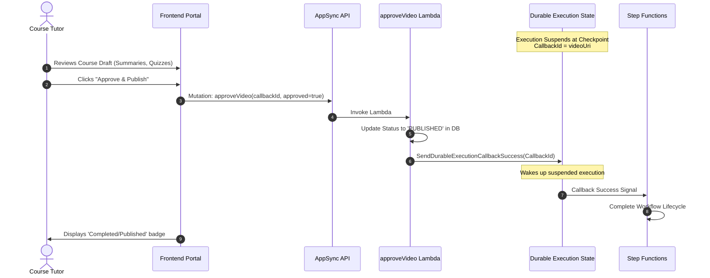

# EduCloud AI Workflow

EduCloud AI is an agentic education pipeline that automatically transcribes, translates, segments, and builds interactive study courses (summaries, multiple-choice quizzes, flashcards, key takeaways) from raw lecture videos.

It leverages a hybrid architecture combining **AWS Step Functions** (for serverless pipeline orchestration) and **AWS Lambda Durable Functions** (for stateful human-in-the-loop approvals).

---

## 🏗️ System Architecture

### 1. Core Workflow (AWS Step Functions)
The pipeline is orchestrated by the `GenerateEmbeddingsStateMachine` using the **JSONata** query language to manage data transformations natively between steps.

```mermaid
graph TD
    S3[Video Uploaded to S3] -->|S3 Object Created| InvokeLambda[invokeWorkflow Lambda]
    InvokeLambda -->|Start Execution| SFN[GenerateEmbeddings State Machine]
    
    subgraph Step Functions JSONata Pipeline
        SFN --> StartEmbed[StartAsyncInvoke Bedrock]
        StartEmbed --> WaitEmbed[Wait 15s]
        WaitEmbed --> GetEmbed[GetAsyncInvoke Bedrock]
        GetEmbed --> ChoiceEmbed{Is Embedding Ready?}
        ChoiceEmbed -->|No| WaitEmbed
        ChoiceEmbed -->|Yes| SaveEmbed[SaveEmbeddings Lambda]
        
        SaveEmbed --> StartTrans[StartTranscribe Lambda]
        StartTrans --> WaitTrans[Wait 15s]
        WaitTrans --> GetTrans[GetTranscribeStatus Lambda]
        GetTrans --> ChoiceTrans{Is Transcript Ready?}
        ChoiceTrans -->|No| WaitTrans
        ChoiceTrans -->|Yes| Translate[AutoTranslateTranscript Lambda]
        
        Translate --> Segment[SegmentSyllabus Lambda]
        
        Segment --> ParallelGen[Parallel Processing]
        
        subgraph ParallelGen [Parallel Asset Generation]
            direction LR
            subgraph Branch 1 [Global Assets]
                GlobalAssets[GenerateGlobalAssets Lambda]
            end
            subgraph Branch 2 [Lesson Maps]
                ProcessMap[ProcessLessonsMap Map State]
                ProcessMap --> Slice[SliceSegment FFmpeg Lambda]
                Slice --> LessonAssets[GenerateLessonAssets Lambda]
            end
        end
        
        ParallelGen --> SaveDraft[SaveDraft Lambda]
    end
    
    SaveDraft --> DB[(DynamoDB VideoAssetsTable)]
    SaveDraft --> EventBridge[EventBridge status: DRAFT]
    EventBridge --> AppSync[AppSync Subscription]
    AppSync --> Frontend[Frontend Portal]
```

---

## 👥 Human-in-the-Loop Approval (Lambda Durable Functions)

When a course is saved to the database, it enters a `DRAFT` status. To support tutor oversight, the pipeline implements a stateful wait checkpoint utilizing the **Lambda Durable Functions** callback mechanism.

---

## 🛠️ Key Technologies Used

1. **JSONata Map State Syntax**:
   - The Step Functions workflow utilizes **JSONata** for clean, low-code data mapping.
   - Traditional JSONPath `ItemsPath` is replaced with JSONata `Items`.
   - Iteration variables are accessed dynamically through `$states.context.Map.Item.Value` and index offsets through `$states.context.Map.Item.Index`.

2. **Durable Callback Hold**:
   - Lambda Durable Functions checkpoint local executions statefully, releasing active execution resources until a callback signal (`SendDurableExecutionCallbackSuccess`) is fired from the tutor review portal.

3. **FFmpeg S3 Stream Seeking**:
   - Instead of downloading multi-gigabyte videos to local Lambda temp storage, FFmpeg streams video data directly from S3 using presigned GET URLs and HTTP range requests to perform modular cuts instantly.

4. **Multi-Model LLM Orchestration**:
   - **Nova Lite** runs high-throughput content extraction tasks (summaries, flashcards, Q&As).
   - **Nova Pro** runs high-reasoning course structure planning and audits output quality to extract refined **Key Takeaways**.
